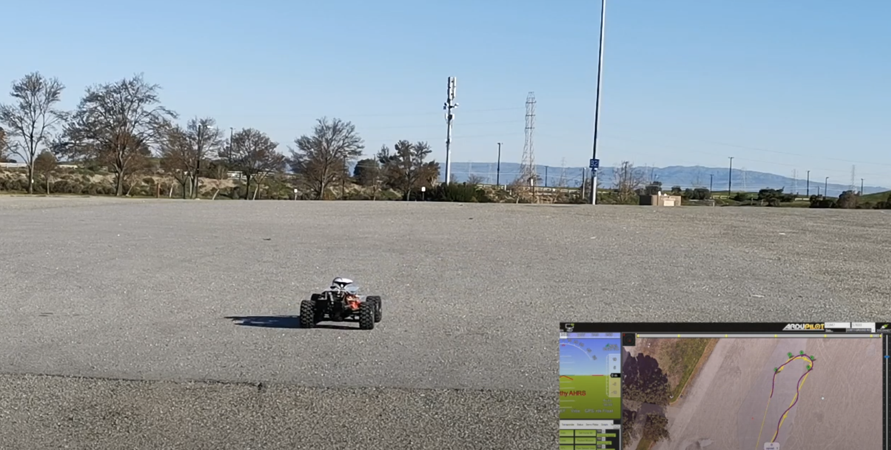
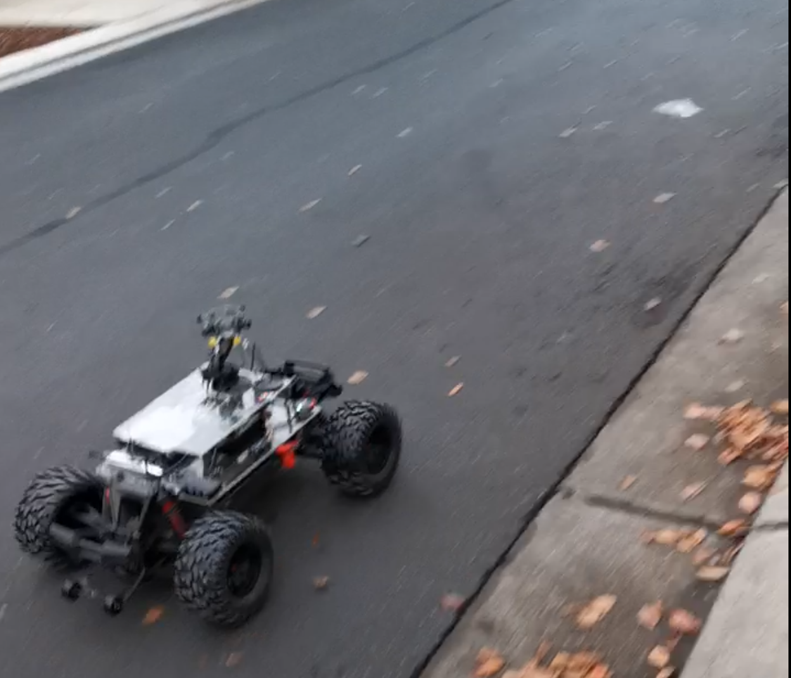
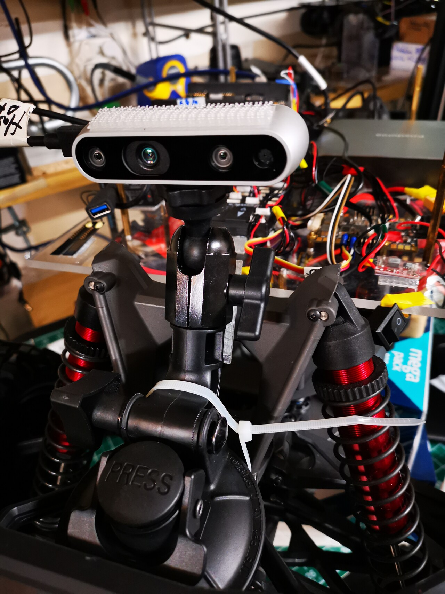

# pixhawk-xmaxx-instructions
The phase 1 goal is to integrate Traxxas X-Maxx with ArduPilot. The setup blog is at 
https://github.com/23garyd/xmaxx-setup/tree/main

GPS mission tests with F9P GPS

The below video is the autonomous drive with GPS RTK.

One of the phase 2 goal is to support vision based obstacle detection with openCV. The Intel D435  camera was used for obstacle detection in ArduPilot platform as experiment.  OAK-D depth camera will be used in the next step. 

